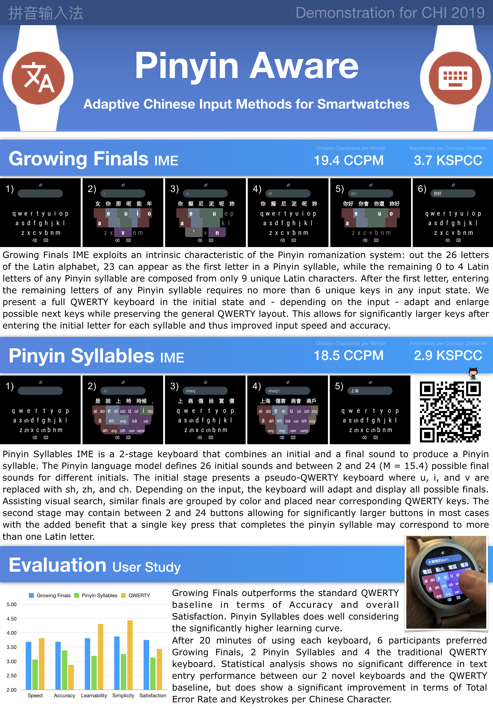

# Pinyin Aware: Adaptive Chinese Input Methods for Smartwatches

## Setup Instructions

1. Connect your Android Wear device and make sure that `adb devices` shows only this one device. The `LG Smart Watch Style` is recommended. Layouts may not correctly scale on smaller or larger devices. Only `armv7` devices are supported due to `librime` native code.
2. Copy the language model files in `/sdcard/rime` by calling [deploy.sh](https://github.com/rednoah/android-wear-pinyin/blob/master/watch-trime/sdcard/deploy.sh) and [reset.sh](https://github.com/rednoah/android-wear-pinyin/blob/master/watch-trime/sdcard/reset.sh). The `reset.sh` script can also be used to reset the keyboard memory after each user study.
3. Open `watch-trime` with Android Studio and run the project.
4. The new keyboards can be tested via the `Pinyin Prototypes (DEMO)` demo app or by enabling the new keyboards in the Android Wear system settings.

## Abstract

Smartwatches, wearable electronics, and other miniature devices are becoming increasingly popular. However, text input on such small devices remains a challenge due to small form factors, especially for non-Latin languages that require more complex text entry techniques. We implement and compare 3 fully functional soft keyboards for typing Mandarin Chinese using the Hanyu Pinyin system on the latest generation of circular smartwatch devices. We introduce 2 such novel adaptive keyboards, Growing Finals and Pinyin Syllables, which change dynamically based on the current input and the limited number of possible subsequent letters, optimize available screen size, and improve the user experience on small screens.
Our evaluation is based on a user study with 15 participants and shows input speeds of around 19.4 CCPM for Growing Finals and 18.5 CCPM for Pinyin Syllables after 20 minutes of practice. More than half of the participants ultimately preferred one of these input methods over the standard QWERTY keyboard due to reduced error rates and more efficient input mechanics.

## Three Pinyin Input Methods

We have designed and implemented 3 Chinese keyboards for circular smartwatches. Each prototype has been implemented natively for Android Wear 2.0 and tested on an LG Watch Style. This smartwatch has a round 1.2" (30 mm) screen.

### Growing Finals Pinyin

Growing Finals IME exploits an intrinsic characteristic of the Pinyin romanization system: out the 26 letters of the Latin alphabet, 23 can appear as the first letter in a Pinyin syllable, while the remaining 0 to 4 Latin letters of any Pinyin syllable are composed from only 9 unique Latin characters. After the first letter, entering the remaining letters of any Pinyin syllable requires no more than 6 unique keys in any input state. We present a full QWERTY keyboard in the initial state and - depending on the input - adapt and enlarge possible next keys while preserving the general QWERTY layout. This allows for significantly larger keys after entering the initial letter for each syllable and thus improved input speed and accuracy.

### Pinyin Syllables

Pinyin Syllables IME is a 2-stage keyboard that combines an initial and a final sound to produce a Pinyin syllable. The Pinyin language model defines 26 initial sounds and between 2 and 24 (M = 15.4) possible final sounds for different initials. The initial stage presents a pseudo-QWERTY keyboard where u, i, and v are replaced with sh, zh, and ch. Depending on the input, the keyboard will adapt and display all possible finals. Assisting visual search, similar finals are grouped by color and placed near corresponding QWERTY keys. The second stage may contain between 2 and 24 buttons allowing for significantly larger buttons in most cases with the added benefit that a single key press that completes the pinyin syllable may correspond to more than one Latin letter.

### Standard Qwerty

We implement the standard QWERTY keyboard with support for Chinese character entry in addition to our two novel input methods to serve as a baseline for comparison. This keyboard design is used by almost all native speakers from China and language students from abroad that type Chinese characters on a computer or smartphone and thus very familiar to most user.

## Evaluation

Growing Finals outperforms the standard QWERTY baseline in terms of Accuracy and overall Satisfaction. Pinyin Syllables does well considering the significantly higher learning curve. After 20 minutes of using each keyboard, 6 participants preferred Growing Finals, 2 Pinyin Syllables and 4 the traditional QWERTY keyboard. Statistical analysis shows no significant difference in text entry performance between our 2 novel keyboards and the QWERTY baseline, but does show a significant improvement in terms of Total Error Rate and Keystrokes per Chinese Character.
